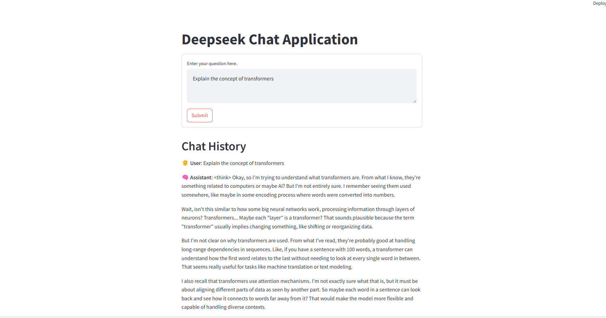

# Deepseek Chat Application - Chatseek

## Description
This is a Streamlit application that allows users to interact with deepseek-r1:1.5b (You can also run higher versions as well). Users can enter questions and receive responses from the AI assistant.

## Installation Instructions
To install the necessary dependencies, run the following commands:
```bash
pip install -U langchain-ollama
pip install langchain
pip install streamlit
```

## Usage
To run the application, use the following command:
```bash
streamlit run deep.py
```

## Maintaining Chat History
The application maintains a chat history to provide context for the AI responses. When a user enters a question, the following steps occur:

1. **Initialization**: The chat history is initialized in the session state if it does not already exist:
   ```python
   if "chat_history" not in st.session_state:
       st.session_state['chat_history'] = []
   ```

2. **Updating Chat History**: Each user input and corresponding AI response are appended to the chat history:
   ```python
   st.session_state['chat_history'].append({'user': text, 'assistant': response})
   ```

3. **Generating Response**: The chat history is used to generate responses, ensuring that the AI has context for the conversation:
   ```python
   chat_history = [system_message]
   for chat in st.session_state['chat_history']:
       chat_history.append(prompt)
   ```

## Image

